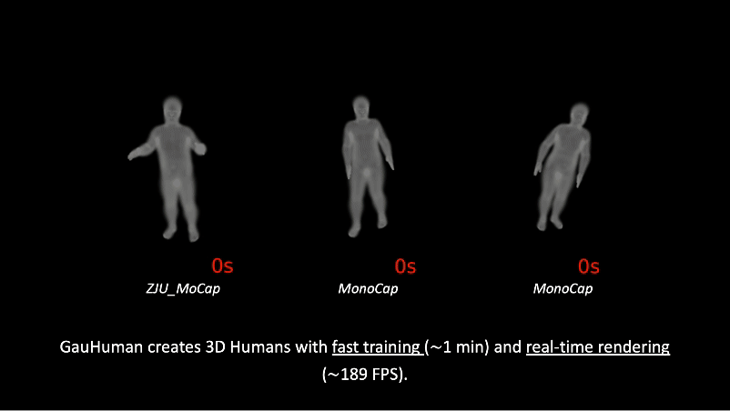

<div align="center">

<h1> MOSS: Motion-based 3D Clothed Human 001 001 Synthesis from Monocular Video</h1>

 

GauHuman learns articulated Gaussian Splatting from monocular videos with both <strong>fast training</strong> (1~2 minutes) and <strong>real-time rendering</strong> (up to 189 FPS).

<div style="width: 70%; text-align: center; margin:auto;">
    
    <em>GauHuman learns articulated Gaussian Splatting from monocular videos with both <strong>fast training</strong> (1~2 minutes) and <strong>real-time rendering</strong> (up to 189 FPS).</em>
</div>

:open_book: For more visual results, go checkout our <a href="http://124.70.164.141:8082" target="_blank">project page</a>

This repository will contain the official implementation of _MOSS_.

<div align="left">
 
## :desktop_computer: Requirements
<!-- --- -->
NVIDIA GPUs are required for this project.
We recommend using anaconda to manage the python environments.

```bash
    conda create --name gauhuman python=3.8
    conda activate gauhuman
    conda install pytorch==2.0.0 torchvision==0.15.0 torchaudio==2.0.0 pytorch-cuda=11.8 -c pytorch -c nvidia
    pip install submodules/diff-gaussian-rasterization
    pip install submodules/simple-knn
    pip install --upgrade https://github.com/unlimblue/KNN_CUDA/releases/download/0.2/KNN_CUDA-0.2-py3-none-any.whl -i https://pypi.tuna.tsinghua.edu.cn/simple

    pip install -r requirement.txt -i https://pypi.tuna.tsinghua.edu.cn/simple
```

Tips: We implement the [alpha mask loss version](https://github.com/ashawkey/diff-gaussian-rasterization) based on the official [diff-gaussian-rasterization](https://github.com/graphdeco-inria/diff-gaussian-rasterization/tree/59f5f77e3ddbac3ed9db93ec2cfe99ed6c5d121d).

## Set up Dataset
<!-- --- -->

Please follow instructions of [Instant-NVR](https://github.com/zju3dv/instant-nvr/blob/master/docs/install.md#set-up-datasets) to download ZJU-Mocap-Refine and MonoCap dataset.


<!-- ## Download SMPL Models

Register and download SMPL models [here](https://smpl.is.tue.mpg.de/). Put the downloaded models in the folder smpl_models. Only the neutral one is needed. The folder structure should look like

```
./
├── ...
└── assets/
    ├── SMPL_NEUTRAL.pkl
``` -->
# TODO:
1. Remove "Cai" in code
2. Remove save txt
2. 法向量的代码
3. 算指标的代次
4. 去掉split clone的数量
5. 确保可复现 （README.md）

## :train: Training
<!-- --- -->

### Training command on ZJU_MoCap_refine dataset
```bash
bash run_zju_mocap_refine.sh
```

### Training command on MonoCap dataset
```bash
bash run_monocap.sh
```

## :running_woman: Evaluation
<!-- --- -->

### Evaluation command on ZJU_MoCap_refine dataset
```bash
bash eval_zju_mocap_refine.sh
```

### Evaluation command on MonoCap dataset
```bash
bash eval_monocap.sh
```

## :love_you_gesture: 
<!-- --- -->

## :newspaper_roll: License

## :raised_hands: Acknowledgements

This project is built on source codes shared by [Gaussian-Splatting](https://github.com/graphdeco-inria/gaussian-splatting), [HumanNeRF](https://github.com/chungyiweng/humannerf), [GauHuman](https://github.com/skhu101/GauHuman) and [Animatable NeRF](https://github.com/zju3dv/animatable_nerf).
