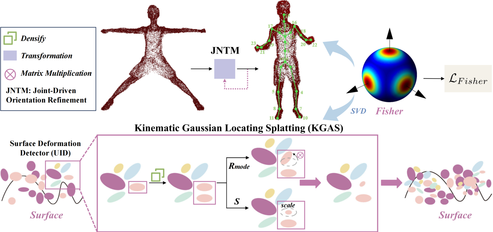

<div align="center">

<h1> MOSS: Motion-based 3D Clothed Human Synthesis from Monocular Video</h1>

 

:open_book: To overcome these limitations, we introduce an innovative framework, </strong>M</strong>otion-Based 3D Cl</strong>o</strong>thed Humans </strong>S</strong>ynthe</strong>s</strong>is (</strong>MOSS</strong>), which employs kinematic information to achieve motion-aware Gaussian split on the human surface. For more visual results, go checkout our <a href="http://124.70.164.141:8082" target="_blank">project page</a>


<div style="width: 70%; text-align: center; margin:auto;">
    
    <em></em>
</div>


<div align="left">
 
## :desktop_computer: Installation
<!-- --- -->

```bash
    conda create --name MOSS python=3.8 -y
    conda activate MOSS
    conda install pytorch==2.0.0 torchvision==0.15.0 torchaudio==2.0.0 pytorch-cuda=11.8 -c pytorch -c nvidia -y
    pip install ninja
    pip install submodules/diff-gaussian-rasterization
    pip install submodules/diff-gaussian-rasterization-obj
    pip install submodules/simple-knn
    pip install --upgrade https://github.com/unlimblue/KNN_CUDA/releases/download/0.2/KNN_CUDA-0.2-py3-none-any.whl
    pip install -r requirement.txt
    # pip install -r requirement.txt -i https://pypi.tuna.tsinghua.edu.cn/simple
```

## :package:​ SMPL Models
Download SMPL Models
Register and download SMPL models here. Put the downloaded models in the folder smpl_models. Only the neutral one is needed. The folder structure should look like

```bash
./
├── ...
└── assets/
    ├── SMPL_NEUTRAL.pkl
```

## :newspaper_roll: Dataset
<!-- --- -->

Please follow instructions of [Instant-NVR](https://github.com/zju3dv/instant-nvr/blob/master/docs/install.md#set-up-datasets) to download ZJU-Mocap-Refine and MonoCap dataset.

## :love_you_gesture: Checkpoint

Download pre-trained model ( [ZJU_mocap](https://1drv.ms/u/s!AmDjVuY0E4VpcxV3HZRSAtLwA6A?e=Ynl7ov) & [Monocap](https://1drv.ms/u/s!AmDjVuY0E4VpcgQWYfwuQMJYa2c?e=MdtblL) ) and put it into the models folder.


```bash
./
├── ...
└── output/
    ├── ZJU.tar.gz
```

```bash
tar -xzvf ZJU.tar.gz 
```

## :train: Training
<!-- --- -->

### Train ZJU_Mocap dataset
```python
python train_ZJU.py
```
Train Monocap dataset
```python
python train_monocap.py
```

## :running_woman: Evaluation
<!-- --- -->

### Evaluation command on ZJU_MoCap_refine dataset

```bash
# Change the path "/home/tom/fsas/workspace/dataset/ZJU_moncap" in the variable "sys_list" to the path of your ZJU_MoCap_refine dataset. refine dataset path.
python render_ZJU.py
```
 


### Evaluation command on MonoCap dataset
```bash
# Change the path the same as ZJU.
python render_monocap.py
```


## :raised_hands: Acknowledgements

Our repository is modified and adapted from these amazing repositories. If you find their work useful for your research, please also consider citing them: [Gaussian-Splatting](https://github.com/graphdeco-inria/gaussian-splatting), [HumanNeRF](https://github.com/chungyiweng/humannerf), [GauHuman](https://github.com/skhu101/GauHuman) and [Animatable NeRF](https://github.com/zju3dv/animatable_nerf).